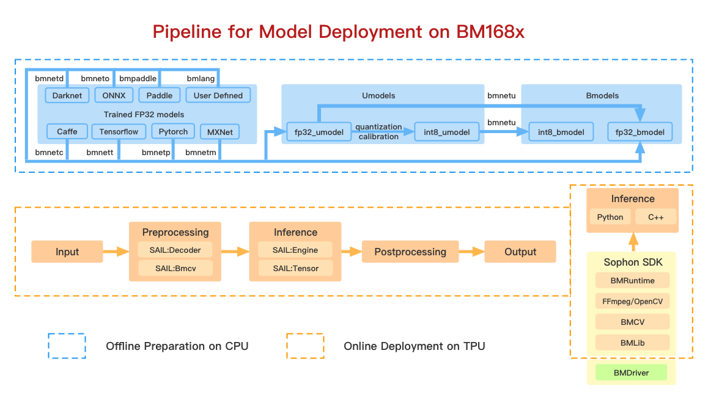
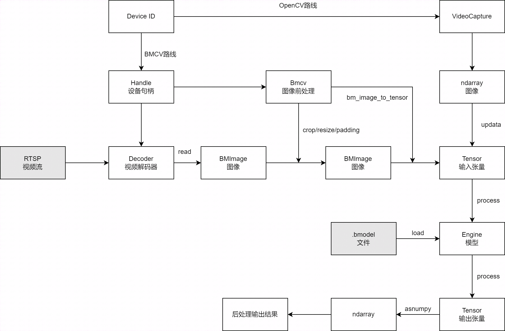

<pre>
   _____ ____  ____  __  ______  _   __     _____ ___    ______ 
  / ___// __ \/ __ \/ / / / __ \/ | / /    / ___//   |  /  _/ / 
  \__ \/ / / / /_/ / /_/ / / / /  |/ /_____\__ \/ /| |  / // /  
 ___/ / /_/ / ____/ __  / /_/ / /|  /_____/__/ / ___ |_/ // /___
/____/\____/_/   /_/ /_/\____/_/ |_/     /____/_/  |_/___/_____/
</pre>

# sophon-sail

Guide to deploying deep-learning inference networks and deep vision primitives on SOPHON TPU.


## SAIL: SOPHON Artificial Intelligent Library for online deployment.

* 打通了视频图像的解码,图像的预处理,模型的推理,且都使用了硬件加速。
* 对bmcv,bmdecoder,bmruntime,bmlib这些接口进行了部分封装
* 使用Tensor自动管理内存
* 提供了一套更加简洁的c++接口,用户可以更加快捷高效的实现整个调用流程。
* 提供了一套Python接口,用户可以更加快捷的进行模型的验证及简单业务的部署,如果有高并发的需求,不建议使用Python接口。
* 提供了源码,用户可以在此基础上bind自己的接口。
* SAIL依赖libsophon,sophon-ffmpeg,sophon-opencv,如果其中任意一个模块进行的版本的更新,SAIL都需要重新进行编译。
* Python接口的效率及灵活性可能不及c++接口及其它libsophon的接口。
* 使用SAIL接口的完整处理流程如下图， 其中预处理方式可以走OpenCV路线或BMCV路线。




## 源码目录结构

```shell
   sophon-sail/
   |── 3rdparty
   │   ├── prebuild  
   │   ├── pybind11   
   │   ├── pybind11_new  
   │   └── spdlog   
   |── cmake                     # Cmake Files
   │   ├── BM168x_ARM_PCIE
   │   ├── BM168x_LoongArch64
   │   ├── BM168x_RISCV
   │   └── BM168x_SOC
   |── docs                      # Documentation codes
   │   ├── common
   │   ├── source_common
   │   └── source_zh
   |── include                   # Includes
   |── python                    # Wheel codes
   |── python_wheels             # Python Wheels
   │   ├── arm_pcie 
   │   ├── loongarch
   │   └── soc  
   ├── sample                    # Sample files
   │   ├── cpp
   │   └── python
   └── src                       # Source codes
```

## 编译及安装

### 编译参数

* BUILD_TYPE : 编译的类型,目前有pcie和soc两种模式,pcie是编译在x86主机上可用的SAIL包,soc表示使用交叉编译的方式,在x86主机上编译soc上可用的SAIL包,arm_pcie表示使用交叉编译的方式,在x86主机上编译插有bm168x卡的arm主机上可用的SAIL包。默认pcie。
   
* ONLY_RUNTIME : 编译结果是否只包含运行时,而不包含bmcv,sophon-ffmpeg,sophon-opencv,如果此编译选项为`ON`,这SAIL的编解码及Bmcv接口不可用,只有推理接口可用。默认`OFF`。
   
* INSTALL_PREFIX : 执行make install时的安装路径,pcie模式下默认`/opt/sophon`,与libsophon的安装路径一致,交叉编译模式下默认`build_soc`。
   
* PYTHON_EXECUTABLE : 编译使用的python3的路径名称(路径+名称),默认使用当前系统中默认的python3。
   
* CUSTOM_PY_LIBDIR : 编译使用的python3的动态库的路径(只包含路径),默认使用当前系统中默认python3的动态库目录。
   
* LIBSOPHON_BASIC_PATH : 交叉编译模式下,libsophon的路径,如果配置不正确则会编译失败。pcie模式下面此编译选项不生效。
   
* FFMPEG_BASIC_PATH : 交叉编译模式下,sophon-ffmpeg的路径,如果配置不正确,且ONLY_RUNTIME为`ON`时会编译失败。pcie模式下面此编译选项不生效。
   
* OPENCV_BASIC_PATH : 交叉编译模式下,sophon-opencv的路径,如果配置不正确,且ONLY_RUNTIME为`ON`时会编译失败。pcie模式下面此编译选项不生效。

* TOOLCHAIN_BASIC_PATH : 交叉编译模式下,交叉编译器的路径,目前只有在BUILD_TYPE为loongarch时生效。

* BUILD_PYSAIL : 编译结果是否包含python版SAIL,默认为为“ON”,包含python版本SAIL。

### 编译可被C++接口调用的动态库及头文件

### PCIE MODE

#### 安装libsophon,sophon-ffmpeg,sophon-opencv的SAIL

libsophon,sophon-ffmpeg,sophon-opencv的安装方式可参考算能官方文档

#### 编译包含多媒体模块的SAIL

使用默认安装路径,编译包含bmcv,sophon-ffmpeg,sophon-opencv的SAIL

1. 下载sophon-sail源码,解压后进入其源码目录

2. 创建编译文件夹build,并进入build文件夹

    ```bash
    mkdir build && cd build 
    ```       

3. 执行编译命令
    ```bash
    cmake -DBUILD_PYSAIL=OFF ..
    make sail
    ```
4. 安装SAIL动态库及头文件,编译结果将安装在`/opt/sophon`下面
    ```
    sudo make install
    ```

#### 编译不包含多媒体模块的SAIL

使用默认安装路径,编译不包含bmcv,sophon-ffmpeg,sophon-opencv的SAIL,

通过此方式编译出来的SAIL无法使用其Decoder、Encoder、Bmcv等多媒体相关接口。

1. 下载sophon-sail源码,解压后进入其源码目录

2. 创建编译文件夹build,并进入build文件夹
    ```
    mkdir build && cd build
    ```

3. 执行编译命令
    ```
    cmake -DONLY_RUNTIME=ON -DBUILD_PYSAIL=OFF ..
    make sail
    ```

4. 安装SAIL动态库及头文件,编译结果将安装在`/opt/sophon`下面
    ```
    sudo make install
    ```

### SOC MODE

#### 获取交叉编译需要使用的libsophon,sophon-ffmpeg,sophon-opencv

*此章节所有的编译操作都是在x86主机上,使用交叉编译的方式进行编译。下面示例中选择libsophon的版本为0.4.1, sophon-ffmpeg的版本为0.4.1,sophon-opencv的版本为0.4.1。*

1. 从算能官网中获取`libsophon_soc_0.4.1_aarch64.tar.gz`,并解压
    ```
    tar -xvf libsophon_soc_0.4.1_aarch64.tar.gz
    ```
解压后libsophon的目录为`libsophon_soc_0.4.1_aarch64/opt/sophon/libsophon-0.4.1`

2. 从算能官网中获取`sophon-mw-soc_0.4.1_aarch64.tar.gz`,并解压
    ```
    tar -xvf sophon-mw-soc_0.4.1_aarch64.tar.gz
    ```

解压后sophon-ffmpeg的目录为`sophon-mw-soc_0.4.1_aarch64/opt/sophon/sophon-ffmpeg_0.4.1`。

解压后sophon-opencv的目录为`sophon-mw-soc_0.4.1_aarch64/opt/sophon/sophon-opencv_0.4.1`。

#### 安装g++-aarch64-linux-gnu工具链

*如果已经安装,可忽略此步骤*
    ```
    sudo apt-get install gcc-aarch64-linux-gnu g++-aarch64-linux-gnu
    ```

#### 编译包含多媒体模块的SAIL

通过交叉编译的方式,编译出包含bmcv,sophon-ffmpeg,sophon-opencv的SAIL。

1. 下载sophon-sail源码,解压后进入其源码目录

2. 创建编译文件夹build,并进入build文件夹
    ```
    mkdir build && cd build
    ```

3. 执行编译命令
    ```
    cmake -DBUILD_TYPE=soc -DBUILD_PYSAIL=OFF \
        -DCMAKE_TOOLCHAIN_FILE=../cmake/BM168x_SOC/ToolChain_aarch64_linux.cmake \
        -DLIBSOPHON_BASIC_PATH=libsophon_soc_0.4.1_aarch64/opt/sophon/libsophon-0.4.1 \
        -DFFMPEG_BASIC_PATH=sophon-mw-soc_0.4.1_aarch64/opt/sophon/sophon-ffmpeg_0.4.1 \
        -DOPENCV_BASIC_PATH=sophon-mw-soc_0.4.1_aarch64/opt/sophon/sophon-opencv_0.4.1 ..
    make sail
    ```

4. 安装SAIL动态库及头文件,程序将自动在源码目录下创建`build_soc`,编译结果将安装在`build_soc`下面
    ```
    make install
    ```

5. 将`build_soc`文件夹下的`sophon-sail`拷贝至目标SOC的`/opt/sophon`目录下,即可在soc上面进行调用。

#### 编译不包含多媒体模块的SAIL

通过交叉编译的方式,编译出不包含bmcv,sophon-ffmpeg,sophon-opencv的SAIL。

*通过此方式编译出来的SAIL无法使用其Decoder、Encoder、Bmcv等多媒体相关接口。*

1. 下载sophon-sail源码,解压后进入其源码目录

2. 创建编译文件夹build,并进入build文件夹
    ```
    mkdir build && cd build
    ```

3. 执行编译命令
    ```
    cmake -DBUILD_TYPE=soc  \
        -DBUILD_PYSAIL=OFF \
        -DONLY_RUNTIME=ON \
        -DCMAKE_TOOLCHAIN_FILE=../cmake/BM168x_SOC/ToolChain_aarch64_linux.cmake \
        -DLIBSOPHON_BASIC_PATH=libsophon_soc_0.4.1_aarch64/opt/sophon/libsophon-0.4.1 ..
    make sail
    ```

4. 安装SAIL动态库及头文件,程序将自动在源码目录下创建`build_soc`,编译结果将安装在`build_soc`下面
    ```
    make install
    ```

5. 将`build_soc`文件夹下的`sophon-sail`拷贝至目标SOC的`/opt/sophon`目录下,即可在soc上进行调用。

### ARM PCIE MODE

#### 获取交叉编译需要使用的libsophon,sophon-ffmpeg,sophon-opencv

*此章节所有的编译操作都是在x86主机上,使用交叉编译的方式进行编译。下面示例中选择libsophon的版本为0.4.1, sophon-ffmpeg的版本为0.4.1,sophon-opencv的版本为0.4.1。*

1. 从算能官网中获取`libsophon_0.4.1_aarch64.tar.gz`,并解压
    ```
    tar -xvf libsophon_0.4.1_aarch64.tar.gz
    ```
解压后libsophon的目录为`libsophon_0.4.1_aarch64/opt/sophon/libsophon-0.4.1`

2. 从算能官网中获取`sophon-mw_0.4.1_aarch64.tar.gz`,并解压
    ```
    tar -xvf sophon-mw_0.4.1_aarch64.tar.gz
    ```

解压后sophon-ffmpeg的目录为`sophon-mw_0.4.1_aarch64/opt/sophon/sophon-ffmpeg_0.4.1`。

解压后sophon-opencv的目录为`sophon-mw_0.4.1_aarch64/opt/sophon/sophon-opencv_0.4.1`。

#### 安装g++-aarch64-linux-gnu工具链

*如果已经安装,可忽略此步骤*
    ```
    sudo apt-get install gcc-aarch64-linux-gnu g++-aarch64-linux-gnu
    ```

#### 编译包含多媒体模块的SAIL

通过交叉编译的方式,编译出包含bmcv,sophon-ffmpeg,sophon-opencv的SAIL。

1. 下载sophon-sail源码,解压后进入其源码目录

2. 创建编译文件夹build,并进入build文件夹
    ```
    mkdir build && cd build
    ```

3. 执行编译命令
    ```
    cmake -DBUILD_TYPE=arm_pcie  \
        -DBUILD_PYSAIL=OFF \
        -DCMAKE_TOOLCHAIN_FILE=../cmake/BM168x_ARM_PCIE/ToolChain_aarch64_linux.cmake \
        -DLIBSOPHON_BASIC_PATH=libsophon_0.4.1_aarch64/opt/sophon/libsophon-0.4.1 \
        -DFFMPEG_BASIC_PATH=sophon-mw_0.4.1_aarch64/opt/sophon/sophon-ffmpeg_0.4.1 \
        -DOPENCV_BASIC_PATH=sophon-mw_0.4.1_aarch64/opt/sophon/sophon-opencv_0.4.1 ..
    make sail
    ```

4. 安装SAIL动态库及头文件,程序将自动在源码目录下创建`build_arm_pcie`,编译结果将安装在`build_arm_pcie`下面
    ```
    make install
    ```

5. 将`build_arm_pcie`文件夹下的`sophon-sail`拷贝至目标ARM主机的`/opt/sophon`目录下,即可在目标机器上面进行调用。

#### 编译不包含多媒体模块的SAIL

通过交叉编译的方式,编译出不包含bmcv,sophon-ffmpeg,sophon-opencv的SAIL。

*通过此方式编译出来的SAIL无法使用其Decoder、Encoder、Bmcv等多媒体相关接口。*

1. 下载sophon-sail源码,解压后进入其源码目录

2. 创建编译文件夹build,并进入build文件夹
    ```
    mkdir build && cd build
    ```

3. 执行编译命令
    ```
    cmake -DBUILD_TYPE=arm_pcie  \
        -DONLY_RUNTIME=ON \
        -DBUILD_PYSAIL=OFF \
        -DCMAKE_TOOLCHAIN_FILE=../cmake/BM168x_ARM_PCIE/ToolChain_aarch64_linux.cmake \
        -DLIBSOPHON_BASIC_PATH=libsophon_0.4.1_aarch64/opt/sophon/libsophon-0.4.1 ..
    make sail
    ```

4. 安装SAIL动态库及头文件,程序将自动在源码目录下创建`build_arm_pcie`,编译结果将安装在`build_arm_pcie`下面
    ```
    make install
    ```

5. 将`build_arm_pcie`文件夹下的`sophon-sail`拷贝至目标ARM主机的`/opt/sophon`目录下,即可在目标机器上面进行调用。

### LOONGARCH64 MODE

#### 安装loongarch64-linux-gnu工具链

从LoongArch64官网获取其[交叉编译的工具链](http://ftp.loongnix.cn/toolchain/gcc/release/loongarch/gcc8/loongson-gnu-toolchain-8.3-x86_64-loongarch64-linux-gnu-rc1.1.tar.xz), 解压到本地，解压后的目录结构如下:

```shell
└── loongson-gnu-toolchain-8.3-x86_64-loongarch64-linux-gnu-rc1.1
    ├── bin
    ├── lib
    ├── lib64
    ├── libexec
    ├── loongarch64-linux-gnu
    ├── share
    ├── sysroot
    └── versions
```

#### 获取交叉编译需要使用的libsophon,sophon-ffmpeg,sophon-opencv

*此章节所有的编译操作都是在x86主机上,使用交叉编译的方式进行编译。下面示例中选择libsophon的版本为0.4.7, sophon-ffmpeg的版本为0.6.0,sophon-opencv的版本为0.6.0。*

#### 编译包含多媒体模块的SAIL

通过交叉编译的方式,编译出包含bmcv,sophon-ffmpeg,sophon-opencv的SAIL,

1. 下载sophon-sail源码,解压后进入其源码目录

2. 创建编译文件夹build,并进入build文件夹
    ```
    mkdir build && cd build
    ```

3. 执行编译命令
    ```
    cmake -DBUILD_TYPE=loongarch  \
        -DBUILD_PYSAIL=OFF \
        -DTOOLCHAIN_BASIC_PATH=toolchains/loongson-gnu-toolchain-8.3-x86_64-loongarch64-linux-gnu-rc1.1 \
        -DCMAKE_TOOLCHAIN_FILE=../cmake/BM168x_LoongArch64/ToolChain_loongarch64_linux.cmake \
        -DLIBSOPHON_BASIC_PATH=libsophon_0.4.7_loongarch64/opt/sophon/libsophon-0.4.7 \
        -DFFMPEG_BASIC_PATH=sophon-mw_0.6.0_loongarch64/opt/sophon/sophon-ffmpeg_0.6.0 \
        -DOPENCV_BASIC_PATH=sophon-mw_0.6.0_loongarch64/opt/sophon/sophon-opencv_0.6.0  \
        ..
    make sail
    ```

4. 安装SAIL动态库及头文件,程序将自动在源码目录下创建`build_loongarch`,编译结果将安装在`build_loongarch`下面
    ```
    make install
    ```

5. 将`build_loongarch`文件夹下的`sophon-sail`拷贝至目标龙芯主机的`/opt/sophon`目录下,即可在目标机器上调用。

#### 编译不包含多媒体模块的SAIL

通过交叉编译的方式,编译出不包含bmcv,sophon-ffmpeg,sophon-opencv的SAIL。

*通过此方式编译出来的SAIL无法使用其Decoder、Encoder、Bmcv等多媒体相关接口。*

1. 下载sophon-sail源码,解压后进入其源码目录

2. 创建编译文件夹build,并进入build文件夹
    ```
    mkdir build && cd build
    ```

3. 执行编译命令
    ```
    cmake -DBUILD_TYPE=loongarch  \
        -DBUILD_PYSAIL=OFF \
        -DONLY_RUNTIME=ON \
        -DTOOLCHAIN_BASIC_PATH=toolchains/loongson-gnu-toolchain-8.3-x86_64-loongarch64-linux-gnu-rc1.1 \
        -DCMAKE_TOOLCHAIN_FILE=../cmake/BM168x_LoongArch64/ToolChain_loongarch64_linux.cmake \
        -DLIBSOPHON_BASIC_PATH=libsophon_0.4.7_loongarch64/opt/sophon/libsophon-0.4.7 \
        ..
    make sail
    ```

4. 安装SAIL动态库及头文件,程序将自动在源码目录下创建`build_loongarch`,编译结果将安装在`build_loongarch`下面
    ```
    make install
    ```

5. 将`build_loongarch`文件夹下的`sophon-sail`拷贝至目标龙芯主机的`/opt/sophon`目录下,即可在目标机器上调用。

### RISCV MODE

#### 获取交叉编译需要使用的libsophon,sophon-ffmpeg,sophon-opencv

*此章节所有的编译操作都是在x86主机上,使用交叉编译的方式进行编译。下面示例中选择libsophon的版本为0.5.0, sophon-ffmpeg的版本为0.6.0,sophon-opencv的版本为0.6.0。*

1. 从算能官网中获取`libsophon_0.5.0_riscv64.tar.gz`,并解压
    ```
    tar -xvf libsophon_0.5.0_riscv64.tar.gz
    ```
解压后libsophon的目录为`libsophon_0.5.0_riscv64/opt/sophon/libsophon-0.5.0`

2. 从算能官网中获取`sophon-mw_0.6.0_riscv_64.tar.gz`,并解压
    ```
    tar -xvf sophon-mw_0.6.0_riscv_64.tar.gz
    ```

解压后sophon-ffmpeg的目录为`sophon-mw_0.6.0_riscv_64/opt/sophon/sophon-ffmpeg_0.6.0`。

解压后sophon-opencv的目录为`sophon-mw_0.6.0_riscv_64/opt/sophon/sophon-opencv_0.6.0`。

#### 安装g++-riscv64-linux-gnu工具链

*如果已经安装,可忽略此步骤*
    ```
    sudo apt-get install gcc-riscv64-linux-gnu g++-riscv64-linux-gnu
    ```

#### 编译包含多媒体模块的SAIL

通过交叉编译的方式,编译出包含bmcv,sophon-ffmpeg,sophon-opencv的SAIL。

1. 下载sophon-sail源码,解压后进入其源码目录

2. 创建编译文件夹build,并进入build文件夹
    ```
    mkdir build && cd build
    ```

3. 执行编译命令
    ```
    cmake -DBUILD_TYPE=riscv  \
        -DBUILD_PYSAIL=OFF \
        -DCMAKE_TOOLCHAIN_FILE=../cmake/BM168x_RISCV/ToolChain_riscv64_linux.cmake \
        -DLIBSOPHON_BASIC_PATH=libsophon_0.5.0_riscv64/opt/sophon/libsophon-0.5.0 \
        -DFFMPEG_BASIC_PATH=sophon-mw_0.6.0_riscv_64/opt/sophon/sophon-ffmpeg_0.6.0 \
        -DOPENCV_BASIC_PATH=sophon-mw_0.6.0_riscv_64/opt/sophon/sophon-opencv_0.6.0 ..                                   
    make sail 
    ```

4. 安装SAIL动态库及头文件,程序将自动在源码目录下创建`build_riscv`,编译结果将安装在`build_riscv`下面
    ```
    make install
    ```

5. 将`build_riscv`文件夹下的`sophon-sail`拷贝至目标ARM主机的`/opt/sophon`目录下,即可在目标机器上面进行调用。

#### 编译不包含多媒体模块的SAIL

通过交叉编译的方式,编译出不包含bmcv,sophon-ffmpeg,sophon-opencv的SAIL。

*通过此方式编译出来的SAIL无法使用其Decoder、Encoder、Bmcv等多媒体相关接口。*

1. 下载sophon-sail源码,解压后进入其源码目录

2. 创建编译文件夹build,并进入build文件夹
    ```
    mkdir build && cd build
    ```

3. 执行编译命令
    ```
    cmake -DBUILD_TYPE=riscv  \
        -DONLY_RUNTIME=ON \
        -DBUILD_PYSAIL=OFF \
        -DCMAKE_TOOLCHAIN_FILE=../cmake/BM168x_RISCV/ToolChain_riscv64_linux.cmake \
        -DLIBSOPHON_BASIC_PATH=libsophon_0.5.0_riscv64/opt/sophon/libsophon-0.5.0 ..
    make sail 
    ```

4. 安装SAIL动态库及头文件,程序将自动在源码目录下创建`build_riscv`,编译结果将安装在`build_riscv`下面
    ```
    make install
    ```

5. 将`build_riscv`文件夹下的`sophon-sail`拷贝至目标ARM主机的`/opt/sophon`目录下,即可在目标机器上面进行调用。

### WINDOWS MODE

#### 安装libsophon,sophon-ffmpeg,sophon-opencv的SAIL

windows下libsophon,sophon-ffmpeg,sophon-opencv的安装方式可参考算能官方文档

#### 安装Visual Studio 2019 作为windows下的开发工具

#### 编译包含多媒体模块的SAIL

编译出包含bmcv,sophon-ffmpeg,sophon-opencv的SAIL

1. 下载sophon-sail源码,解压后进入其源码目录

2. 创建编译文件夹build,并进入build文件夹          

3. 执行cmake命令，生成项目文件 .sln

    ```
    cmake -DBUILD_TYPE=windows \
        -DTARGET_TYPE=release \
        -DRUNTIME_LIB=MT \
        -DBUILD_PYSAIL=OFF \
        -DLIBSOPHON_DIR=C:/sophon_sdk_win_release_MT/libsophon_0.4.9/data \
        -DOPENCV_DIR=C:/sophon_sdk_win_release_MT/sophon-opencv_0.6.0/lib/cmake/opencv4 \
        -DFFMPEG_DIR=C:/sophon_sdk_win_release_MT/sophon-ffmpeg_0.6.0/lib/cmake ..
    ```

                                    
4. 在vs2019下打开.sln项目文件，修改编译模式为release，点击生成项目。

5. 项目编译成功后会在build/lib/Release文件夹下生成sail.lib,sail.exp,sail.dll等文件。

6. 安装sail库，在build路径下运行指令,生成build_windows文件夹

    ```
    cmake --install . 
    * 将sail.dll所在路径加入PATH环境变量    
    ```                 

7. 在CMakeLists.txt文件中引入sail库即可，如：

    ```
    set(SAIL_DIR your_path/build_windows/sophon-sail/lib/cmake)
    find_package(SAIL REQUIRED)
    include_directories(${SAIL_INCLUDE_DIRS})
    link_directories(${SAIL_LIB_DIRS})
        ...
    target_link_libraries(your_project sail.lib)    
    ```


#### 编译不包含多媒体模块的SAIL

编译不包含bmcv,sophon-ffmpeg,sophon-opencv的SAIL,

*通过此方式编译出来的SAIL无法使用其Decoder、Encoder、Bmcv等多媒体相关接口。*

1. 下载sophon-sail源码,解压后进入其源码目录

2. 创建编译文件夹build,并进入build文件夹          

3. 执行cmake命令，生成项目文件 .sln

    ```
    cmake -DBUILD_TYPE=windows \
        -DTARGET_TYPE=release \
        -DRUNTIME_LIB=MT \
        -DBUILD_PYSAIL=OFF \
        -DONLY_RUNTIME=ON \
        -DLIBSOPHON_DIR=C:/sophon_sdk_win_release_MT/libsophon_0.4.9/data ..
    ```

                                   
4. 在vs2019下打开.sln项目文件，修改编译模式为release，点击生成项目。

5. 项目编译成功后会在build/lib/Release文件夹下生成sail.lib,sail.exp,sail.dll等文件。

6. 安装sail库，在build路径下运行指令,生成build_windows文件夹

    ```
    cmake --install .
    * 将sail.dll所在路径加入PATH环境变量    
    ```              

7. 在CMakeLists.txt文件中引入sail库即可，如：

    ```
    set(SAIL_DIR your_path/build_windows/sophon-sail/lib/cmake)
    find_package(SAIL REQUIRED)
    include_directories(${SAIL_INCLUDE_DIRS})
    link_directories(${SAIL_LIB_DIRS})
        ...
    target_link_libraries(your_project sail.lib)    
    ```

### 编译可被Python3接口调用的Wheel文件

### PCIE MODE

#### 安装libsophon,sophon-ffmpeg,sophon-opencv

libsophon,sophon-ffmpeg,sophon-opencv的安装方式可参考算能官方文档

#### 编译包含多媒体模块的SAIL

使用默认安装路径,编译包含bmcv,sophon-ffmpeg,sophon-opencv的SAIL

1. 下载sophon-sail源码,解压后进入其源码目录

2. 创建编译文件夹build,并进入build文件夹

    ```bash
    mkdir build && cd build 
    ```                  

3. 执行编译命令

    ```bash
    cmake ..                                   
    make pysail                                     
    ```

4. 打包生成python wheel,生成的wheel包的路径为`python/dist`,文件名为`sophon-3.8.0-py3-none-any.whl`

    ```bash
    cd ../python
    chmod +x sophon_whl.sh
    ./sophon_whl.sh                              
    ```

5. 安装python whell  

    ```bash
    pip3 install ./dist/sophon-3.8.0-py3-none-any.whl --force-reinstall
    ```


#### 编译不包含多媒体模块的SAIL

编译不包含bmcv,sophon-ffmpeg,sophon-opencv的SAIL,

*通过此方式编译出来的SAIL无法使用其Decoder、Encoder、Bmcv等多媒体相关接口。*

1. 下载sophon-sail源码,解压后进入其源码目录

2. 创建编译文件夹build,并进入build文件夹

    ```bash
    mkdir build && cd build                   
    ```

3. 执行编译命令

    ```bash
    cmake -DONLY_RUNTIME=ON ..                                   
    make pysail                                   
    ```

4. 打包生成python wheel,生成的wheel包的路径为`python/dist`,文件名为`sophon-3.8.0-py3-none-any.whl`

    ```bash
    cd ../python
    chmod +x sophon_whl.sh
    ./sophon_whl.sh                           
    ```

5. 安装python whell  

    ```bash
    pip3 install ./dist/sophon-3.8.0-py3-none-any.whl --force-reinstall
    ```


#### 编译指定Python版本的SAIL

如果生产环境与开发环境上的python3版本不一致,可以通过升级python3版本使其保持一致, 也可以通过python3的官方网站获取获取相应的python3包, 或者根据[获取在X86主机上进行交叉编译的Python3](./GETPYTHON.md)获取已经编译好的python3。 也就是使用非系统默认的python3,编译包含bmcv,sophon-ffmpeg,sophon-opencv的SAIL,并打包到‘build_pcie’目录下, 本示例使用的python3路径为`python_3.8.2/bin/python3`,python3的动态库目录`python_3.8.2/lib`。

1. 下载sophon-sail源码,解压后进入其源码目录

2. 创建编译文件夹build,并进入build文件夹

    ```bash
    mkdir build && cd build                   
    ```

3. 执行编译命令

    ```bash
    cmake -DPYTHON_EXECUTABLE=python_3.8.2/bin/python3 -DCUSTOM_PY_LIBDIR=python_3.8.2/lib ..
    make pysail                                    
    ```

4. 打包生成python wheel,生成的wheel包的路径为`python/dist`,文件名为`sophon-3.8.0-py3-none-any.whl`

    ```bash
    cd ../python
    chmod +x sophon_whl.sh
    ./sophon_whl.sh                           
    ```

5. 安装python wheel  

    将`sophon-3.8.0-py3-none-any.whl`拷贝到目标机器上,然后执行如下安装命令

    ```bash
    pip3 install ./dist/sophon-3.8.0-py3-none-any.whl --force-reinstall
    ```

### SOC MODE

#### 获取交叉编译需要使用的libsophon,sophon-ffmpeg,sophon-opencv

*此章节所有的编译操作都是在x86主机上,使用交叉编译的方式进行编译。下面示例中选择libsophon的版本为0.4.1, sophon-ffmpeg的版本为0.4.1,sophon-opencv的版本为0.4.1。*

1. 从算能官网中获取`libsophon_soc_0.4.1_aarch64.tar.gz`,并解压

    ```bash
    tar -xvf libsophon_soc_0.4.1_aarch64.tar.gz
    ```

    解压后libsophon的目录为`libsophon_soc_0.4.1_aarch64/opt/sophon/libsophon-0.4.1`

2. 从算能官网中获取`sophon-mw-soc_0.4.1_aarch64.tar.gz`,并解压

    ```bash
    tar -xvf sophon-mw-soc_0.4.1_aarch64.tar.gz
    ```

    解压后sophon-ffmpeg的目录为`sophon-mw-soc_0.4.1_aarch64/opt/sophon/sophon-ffmpeg_0.4.1`。

    解压后sophon-opencv的目录为`sophon-mw-soc_0.4.1_aarch64/opt/sophon/sophon-opencv_0.4.1`。

#### 安装g++-aarch64-linux-gnu工具链

*如果已经安装,可忽略此步骤*
    
```bash
sudo apt-get install gcc-aarch64-linux-gnu g++-aarch64-linux-gnu
```

#### 编译包含多媒体模块的SAIL

使用指定版本的python3(和目标SOC上的python3保持一致),通过交叉编译的方式,编译出包含bmcv,sophon-ffmpeg,sophon-opencv的SAIL, python3的安装方式可通过python官方网站获取, 也可以根据[获取在X86主机上进行交叉编译的Python3](./GETPYTHON.md)获取已经编译好的python3。 本示例使用的python3路径为`python_3.8.2/bin/python3`,python3的动态库目录`python_3.8.2/lib`。

1. 下载sophon-sail源码,解压后进入其源码目录

2. 创建编译文件夹build,并进入build文件夹

    ```bash
    mkdir build && cd build 
    ```                  

3. 执行编译命令

    ```bash
    cmake -DBUILD_TYPE=soc  \
        -DCMAKE_TOOLCHAIN_FILE=../cmake/BM168x_SOC/ToolChain_aarch64_linux.cmake \
        -DPYTHON_EXECUTABLE=python_3.8.2/bin/python3 \
        -DCUSTOM_PY_LIBDIR=python_3.8.2/lib \
        -DLIBSOPHON_BASIC_PATH=libsophon_soc_0.4.1_aarch64/opt/sophon/libsophon-0.4.1 \
        -DFFMPEG_BASIC_PATH=sophon-mw-soc_0.4.1_aarch64/opt/sophon/sophon-ffmpeg_0.4.1 \
        -DOPENCV_BASIC_PATH=sophon-mw-soc_0.4.1_aarch64/opt/sophon/sophon-opencv_0.4.1 ..
    make pysail                                   
    ```

4. 打包生成python wheel,生成的wheel包的路径为`python/dist`,文件名为`sophon_arm-3.8.0-py3-none-any.whl`

    ```bash
    cd ../python
    chmod +x sophon_whl.sh
    ./sophon_whl.sh                             
    ```

5. 安装python wheel  

    将`sophon_arm-3.8.0-py3-none-any.whl`拷贝到目标SOC上,然后执行如下安装命令

    ```bash
    pip3 install sophon_arm-3.8.0-py3-none-any.whl --force-reinstall
    ```

#### 编译不包含多媒体模块的SAIL

使用指定版本的python3(和目标SOC上的python3保持一致),通过交叉编译的方式,编译出不包含bmcv,sophon-ffmpeg,sophon-opencv的SAIL, python3的安装方式可通过python官方网站获取, 也可以根据[获取在X86主机上进行交叉编译的Python3](./GETPYTHON.md)获取已经编译好的python3。 本示例使用的python3路径为`python_3.8.2/bin/python3`,python3的动态库目录`python_3.8.2/lib`。

*通过此方式编译出来的SAIL无法使用其Decoder、Encoder、Bmcv等多媒体相关接口。*

1. 下载sophon-sail源码,解压后进入其源码目录

2. 创建编译文件夹build,并进入build文件夹

    ```bash
    mkdir build && cd build 
    ```                  

3. 执行编译命令

    ```bash
    cmake -DBUILD_TYPE=soc  \
        -DONLY_RUNTIME=ON \
        -DCMAKE_TOOLCHAIN_FILE=../cmake/BM168x_SOC/ToolChain_aarch64_linux.cmake \
        -DPYTHON_EXECUTABLE=python_3.8.2/bin/python3 \
        -DCUSTOM_PY_LIBDIR=python_3.8.2/lib \
        -DLIBSOPHON_BASIC_PATH=libsophon_soc_0.4.1_aarch64/opt/sophon/libsophon-0.4.1 ..
    make pysail                                    
    ```

4. 打包生成python wheel,生成的wheel包的路径为`python/dist`,文件名为`sophon_arm-3.8.0-py3-none-any.whl`

    ```bash
    cd ../python
    chmod +x sophon_whl.sh
    ./sophon_whl.sh                             
    ```

5. 安装python wheel  

    将`sophon_arm-3.8.0-py3-none-any.whl`拷贝到目标SOC上,然后执行如下安装命令

    ```bash
    pip3 install sophon_arm-3.8.0-py3-none-any.whl --force-reinstall
    ```

### ARM PCIE MODE

#### 获取交叉编译需要使用的libsophon,sophon-ffmpeg,sophon-opencv

*此章节所有的编译操作都是在x86主机上,使用交叉编译的方式进行编译。下面示例中选择libsophon的版本为0.4.1, sophon-ffmpeg的版本为0.4.1,sophon-opencv的版本为0.4.1。*

1. 从算能官网中获取`libsophon_0.4.1_aarch64.tar.gz`,并解压

    ```bash
    tar -xvf libsophon_0.4.1_aarch64.tar.gz
    ```

    解压后libsophon的目录为`libsophon_0.4.1_aarch64/opt/sophon/libsophon-0.4.1`

2. 从算能官网中获取`sophon-mw_0.4.1_aarch64.tar.gz`,并解压

    ```bash
    tar -xvf sophon-mw_0.4.1_aarch64.tar.gz
    ```

    解压后sophon-ffmpeg的目录为`sophon-mw_0.4.1_aarch64/opt/sophon/sophon-ffmpeg_0.4.1`。

    解压后sophon-opencv的目录为`sophon-mw_0.4.1_aarch64/opt/sophon/sophon-opencv_0.4.1`。

#### 安装g++-aarch64-linux-gnu工具链

*如果已经安装,可忽略此步骤*

```bash
sudo apt-get install gcc-aarch64-linux-gnu g++-aarch64-linux-gnu
```

#### 编译包含多媒体模块的SAIL

使用指定版本的python3(和目标ARM主机上的python3保持一致),通过交叉编译的方式,编译出包含bmcv,sophon-ffmpeg,sophon-opencv的SAIL, python3的安装方式可通过python官方网站获取, 也可以根据[获取在X86主机上进行交叉编译的Python3](./GETPYTHON.md)获取已经编译好的python3。 本示例使用的python3路径为`python_3.8.2/bin/python3`,python3的动态库目录`python_3.8.2/lib`。

1. 下载sophon-sail源码,解压后进入其源码目录

2. 创建编译文件夹build,并进入build文件夹

    ```bash
    mkdir build && cd build 
    ```                  

3. 执行编译命令

    ```bash
    cmake -DBUILD_TYPE=arm_pcie  \
        -DCMAKE_TOOLCHAIN_FILE=../cmake/BM168x_ARM_PCIE/ToolChain_aarch64_linux.cmake \
        -DPYTHON_EXECUTABLE=python_3.8.2/bin/python3 \
        -DCUSTOM_PY_LIBDIR=python_3.8.2/lib \
        -DLIBSOPHON_BASIC_PATH=libsophon_0.4.1_aarch64/opt/sophon/libsophon-0.4.1 \
        -DFFMPEG_BASIC_PATH=sophon-mw_0.4.1_aarch64/opt/sophon/sophon-ffmpeg_0.4.1 \
        -DOPENCV_BASIC_PATH=sophon-mw_0.4.1_aarch64/opt/sophon/sophon-opencv_0.4.1 ..
    make pysail                                   
    ```

4. 打包生成python wheel,生成的wheel包的路径为`python/dist`,文件名为`sophon_arm_pcie-3.8.0-py3-none-any.whl`

    ```bash
    cd ../python
    chmod +x sophon_whl.sh
    ./sophon_whl.sh                              
    ```

5. 安装python wheel  

    将`sophon_arm_pcie-3.8.0-py3-none-any.whl`拷贝到目标ARM主机上,然后执行如下安装命令

    ```bash
    pip3 install sophon_arm_pcie-3.8.0-py3-none-any.whl --force-reinstall
    ```

#### 编译不包含多媒体模块的SAIL

使用指定版本的python3(和目标ARM主机上的python3保持一致),通过交叉编译的方式,编译出不包含bmcv,sophon-ffmpeg,sophon-opencv的SAIL, python3的安装方式可通过python官方网站获取, 也可以根据[获取在X86主机上进行交叉编译的Python3](./GETPYTHON.md)获取已经编译好的python3。 本示例使用的python3路径为`python_3.8.2/bin/python3`,python3的动态库目录`python_3.8.2/lib`。

*通过此方式编译出来的SAIL无法使用其Decoder、Encoder、Bmcv等多媒体相关接口。*

1. 下载sophon-sail源码,解压后进入其源码目录

2. 创建编译文件夹build,并进入build文件夹

    ```bash
    mkdir build && cd build 
    ```                  

3. 执行编译命令

    ```bash
    cmake -DBUILD_TYPE=arm_pcie  \
        -DONLY_RUNTIME=ON \
        -DCMAKE_TOOLCHAIN_FILE=../cmake/BM168x_ARM_PCIE/ToolChain_aarch64_linux.cmake \
        -DPYTHON_EXECUTABLE=python_3.8.2/bin/python3 \
        -DCUSTOM_PY_LIBDIR=python_3.8.2/lib \
        -DLIBSOPHON_BASIC_PATH=libsophon_0.4.1_aarch64/opt/sophon/libsophon-0.4.1 ..
    make pysail                                  
    ```

4. 打包生成python wheel,生成的wheel包的路径为`python/dist`,文件名为`sophon_arm_pcie-3.8.0-py3-none-any.whl`

    ```bash
    cd ../python
    chmod +x sophon_whl.sh
    ./sophon_whl.sh                              
    ```

5. 安装python wheel  

    将`sophon_arm_pcie-3.8.0-py3-none-any.whl`拷贝到目标ARM主机上,然后执行如下安装命令

    ```bash
    pip3 install sophon_arm_pcie-3.8.0-py3-none-any.whl --force-reinstall
    ```

### LOONGARCH64 MODE

#### 安装loongarch64-linux-gnu工具链

从LoongArch64官网获取其[交叉编译的工具链](http://ftp.loongnix.cn/toolchain/gcc/release/loongarch/gcc8/loongson-gnu-toolchain-8.3-x86_64-loongarch64-linux-gnu-rc1.1.tar.xz), 解压到本地，解压后的目录结构如下：

```shell
└── loongson-gnu-toolchain-8.3-x86_64-loongarch64-linux-gnu-rc1.1
    ├── bin
    ├── lib
    ├── lib64
    ├── libexec
    ├── loongarch64-linux-gnu
    ├── share
    ├── sysroot
    └── versions
```

#### 获取交叉编译需要使用的libsophon

*此章节所有的编译操作都是在x86主机上,使用交叉编译的方式进行编译。下面示例中选择libsophon的版本为0.4.7。*

#### 编译包含多媒体模块的SAIL

使用指定版本的python3(和目标龙芯主机上的python3保持一致),通过交叉编译的方式,编译出不包含bmcv,sophon-ffmpeg,sophon-opencv的SAIL, python3的安装方式可通过python官方网站获取, 也可以根据[获取在X86主机上进行交叉编译的Python3](./GETPYTHON.md)获取已经编译好的python3。 本示例使用的python3路径为`python_3.7.3/bin/python3`,python3的动态库目录`python_3.7.3/lib`。

*通过此方式编译出来的SAIL无法使用其Decoder、Encoder、Bmcv等多媒体相关接口。*

1. 下载sophon-sail源码,解压后进入其源码目录

2. 创建编译文件夹build,并进入build文件夹
    ```
    mkdir build && cd build
    ```

3. 执行编译命令
    ```
    cmake -DBUILD_TYPE=loongarch  \
        -DONLY_RUNTIME=ON \
        -DTOOLCHAIN_BASIC_PATH=toolchains/loongson-gnu-toolchain-8.3-x86_64-loongarch64-linux-gnu-rc1.1 \
        -DCMAKE_TOOLCHAIN_FILE=../cmake/BM168x_LoongArch64/ToolChain_loongarch64_linux.cmake \
        -DPYTHON_EXECUTABLE=python_3.7.3/bin/python3 \
        -DCUSTOM_PY_LIBDIR=python_3.7.3/lib \
        -DLIBSOPHON_BASIC_PATH=libsophon_0.4.7_loongarch64/opt/sophon/libsophon-0.4.7 \
        ..
    make pysail
    ```

*cmake选项中的路径需要您根据环境的配置进行调整*

* DLIBSOPHON_BASIC_PATH: SOPHONSDK中libsophon下对应libsophon_<x.y.z>_loongarch64.tar.gz解压后的目录。

4. 打包生成python wheel,生成的wheel包的路径为`python/dist`,文件名为`sophon_loongarch64-3.4.0-py3-none-any.whl`
    ```
    cd ../python
    chmod +x sophon_whl.sh
    ./sophon_whl.sh
    ```

    注：此处易出现setuptools版本过高的问题，原则上python3.8最高兼容setuptools版本 < 66.0.0

5. 安装python wheel
将`sophon_loongarch64-3.4.0-py3-none-any.whl`拷贝到目标主机上,然后执行如下安装命令
    ```
    pip3 install sophon_loongarch64-3.4.0-py3-none-any.whl --force-reinstall
    ```

### RISCV MODE

#### 获取交叉编译需要使用的libsophon,sophon-ffmpeg,sophon-opencv

*此章节所有的编译操作都是在x86主机上,使用交叉编译的方式进行编译。下面示例中选择libsophon的版本为0.5.0, sophon-ffmpeg的版本为0.6.0,sophon-opencv的版本为0.6.0。*

1. 从算能官网中获取`libsophon_0.5.0_riscv64.tar.gz`,并解压

    ```bash
    tar -xvf libsophon_0.5.0_riscv64.tar.gz
    ```

    解压后libsophon的目录为`libsophon_0.5.0_riscv64/opt/sophon/libsophon-0.5.0`

2. 从算能官网中获取`sophon-mw_0.6.0_riscv64.tar.gz`,并解压

    ```bash
    tar -xvf sophon-mw_0.6.0_riscv64.tar.gz
    ```

    解压后sophon-ffmpeg的目录为`sophon-mw_0.6.0_riscv64/opt/sophon/sophon-ffmpeg_0.6.0`。

    解压后sophon-opencv的目录为`sophon-mw_0.6.0_riscv64/opt/sophon/sophon-opencv_0.6.0 `。

#### 安装g++-riscv64-linux-gnu工具链

*如果已经安装,可忽略此步骤*

```bash
sudo apt-get install gcc-riscv64-linux-gnu g++-riscv64-linux-gnu
```

#### 编译包含多媒体模块的SAIL

使用指定版本的python3(和目标RISCV服务器上的python3保持一致),通过交叉编译的方式,编译出包含bmcv,sophon-ffmpeg,sophon-opencv的SAIL, python3的安装方式可通过python官方网站获取, 也可以根据[获取在X86主机上进行交叉编译的Python3](./GETPYTHON.md)获取已经编译好的python3。 本示例使用的python3路径为`python_3.11.0/bin/python3`,python3的动态库目录`python_3.11.0/lib`。

1. 下载sophon-sail源码,解压后进入其源码目录

2. 创建编译文件夹build,并进入build文件夹

    ```bash
    mkdir build && cd build 
    ```                  

3. 执行编译命令

    ```bash
    cmake -DBUILD_TYPE=riscv  \
        -DCMAKE_TOOLCHAIN_FILE=../cmake/BM168x_RISCV/ToolChain_riscv64_linux.cmake \
        -DPYTHON_EXECUTABLE=python_3.11.0/bin/python3 \
        -DCUSTOM_PY_LIBDIR=python_3.11.0/lib \
        -DLIBSOPHON_BASIC_PATH=libsophon_0.5.0_riscv64/opt/sophon/libsophon-0.5.0 \
        -DFFMPEG_BASIC_PATH=sophon-mw_0.6.0_riscv_64/opt/sophon/sophon-ffmpeg_0.6.0 \
        -DOPENCV_BASIC_PATH=sophon-mw_0.6.0_riscv_64/opt/sophon/sophon-opencv_0.6.0 ..                                   
    make pysail                                    
    ```

4. 打包生成python wheel,生成的wheel包的路径为`python/dist`,文件名为`sophon_riscv64-3.8.0-py3-none-any.whl`

    ```bash
    cd ../python
    chmod +x sophon_whl.sh
    ./sophon_whl.sh                              
    ```

5. 安装python wheel  

    将`sophon_riscv64-3.8.0-py3-none-any.whl`拷贝到目标ARM主机上,然后执行如下安装命令

    ```bash
    pip3 install sophon_riscv64-3.8.0-py3-none-any.whl --force-reinstall
    ```

#### 编译不包含多媒体模块的SAIL

使用指定版本的python3(和目标RISCV服务器上的python3保持一致),通过交叉编译的方式,编译出不包含bmcv,sophon-ffmpeg,sophon-opencv的SAIL, python3的安装方式可通过python官方网站获取, 也可以根据[获取在X86主机上进行交叉编译的Python3](./GETPYTHON.md)获取已经编译好的python3。 本示例使用的python3路径为`python_3.11.0/bin/python3`,python3的动态库目录`python_3.11.0/lib`。

*通过此方式编译出来的SAIL无法使用其Decoder、Encoder、Bmcv等多媒体相关接口。*

1. 下载sophon-sail源码,解压后进入其源码目录

2. 创建编译文件夹build,并进入build文件夹

    ```bash
    mkdir build && cd build 
    ```                  

3. 执行编译命令

    ```bash
    cmake -DBUILD_TYPE=riscv  \
        -DONLY_RUNTIME=ON \
        -DCMAKE_TOOLCHAIN_FILE=../cmake/BM168x_RISCV/ToolChain_riscv64_linux.cmake \
        -DPYTHON_EXECUTABLE=python_3.11.0/bin/python3 \
        -DCUSTOM_PY_LIBDIR=python_3.11.0/lib \
        -DLIBSOPHON_BASIC_PATH=libsophon_0.5.0_riscv64/opt/sophon/libsophon-0.5.0 ..
    make pysail                                   
    ```

4. 打包生成python wheel,生成的wheel包的路径为`python/dist`,文件名为`sophon_riscv64-3.8.0-py3-none-any.whl`

    ```bash
    cd ../python 
    chmod +x sophon_whl.sh
    ./sophon_whl.sh                              
    ```

5. 安装python wheel  

    将`sophon_riscv64-3.8.0-py3-none-any.whl`拷贝到目标ARM主机上,然后执行如下安装命令

    ```bash
    pip3 install sophon_riscv64-3.8.0-py3-none-any.whl --force-reinstall
    ```


### WINDOWS MODE

#### 安装libsophon,sophon-ffmpeg,sophon-opencv的SAIL

windows下libsophon,sophon-ffmpeg,sophon-opencv的安装方式可参考算能官方文档

#### 编译包含多媒体模块的SAIL

编译包含bmcv,sophon-ffmpeg,sophon-opencv的SAIL

1. 下载sophon-sail源码,解压后进入其源码目录

2. 创建编译文件夹build,并进入build文件夹              

3. 执行cmake指令，生成项目文件（.sln）

    ```
    cmake -DBUILD_PYSAIL=ON \
        -DBUILD_TYPE=windows \
        -DTARGET_TYPE=release \
        -DRUNTIME_LIB=MT \
        -DLIBSOPHON_DIR=C:/sophon_sdk_win_release_MT/libsophon_0.4.9/data \
        -DOPENCV_DIR=C:/sophon_sdk_win_release_MT/sophon-opencv_0.6.0/lib/cmake/opencv4 \
        -DFFMPEG_DIR=C:/sophon_sdk_win_release_MT/sophon-ffmpeg_0.6.0/lib/cmake -DPYTHON_EXECUTABLE=C:\Users\Sophgo\AppData\Local\Programs\Python\Python38\python.exe .. 
    ```
                                                                 

4. 在vs2019下打开.sln项目文件，修改编译模式为release，点击生成项目。

5. 在sophon-sail/python/windows路径下运行指令python setup.py bdist_wheel 打包生成dist文件夹下的wheel包，文件名为‘sophon-|ver|-py3-none-any.whl’

6. 安装python wheel  

    ```
    pip3 install ./dist/sophon-|ver|-py3-none-any.whl --force-reinstall 
    ```

*python3.8及以上版本需要显示添加DLL动态库路径才能成功导入sail包，例：*

    ```
    import os
    # 此处路径对应SOPHONSDK的安装位置
    os.add_dll_directory(r'C:\\sophon_sdk_win_release_MT\\libsophon_0.4.9\\bin')
    os.add_dll_directory(r'C:\\sophon_sdk_win_release_MT\\sophon-ffmpeg_0.6.0\\lib')
    os.add_dll_directory(r'C:\\sophon_sdk_win_release_MT\\sophon-opencv_0.6.0\\lib')
    import sophon.sail as sail
    ```


#### 编译不包含多媒体模块的SAIL

编译不包含bmcv,sophon-ffmpeg,sophon-opencv的SAIL,

*通过此方式编译出来的SAIL无法使用其Decoder、Encoder、Bmcv等多媒体相关接口。*

1. 下载sophon-sail源码,解压后进入其源码目录

2. 创建编译文件夹build,并进入build文件夹              

3. 执行cmake指令，生成项目文件（.sln）

    ```
    cmake -DONLY_RUNTIME=ON \
    -DBUILD_PYSAIL=ON \
    -DBUILD_TYPE=windows \
    -DTARGET_TYPE=release \
    -DRUNTIME_LIB=MT  \
    -DLIBSOPHON_DIR=C:/sophon_sdk_win_release_MT/libsophon_0.4.9/data \
    -DPYTHON_EXECUTABLE=C:\\Users\\Sophgo\\AppData\\Local\\Programs\\Python\\Python38\\python.exe ..

    ```
                                           
4. 在vs2019下打开.sln项目文件，修改编译模式为release，点击生成项目。

5. 在sophon-sail/python/windows路径下运行指令python setup.py bdist_wheel 打包生成dist文件夹下的wheel包，文件名为‘sophon-|ver|-py3-none-any.whl’

6. 安装python wheel  

    ```
    pip3 install ./dist/sophon-|ver|-py3-none-any.whl --force-reinstall 
    ```

*python3.8及以上版本需要显示添加DLL动态库路径才能成功导入sail包，例：*

    ```
    import os
    # 此处路径对应SOPHONSDK的安装位置
    os.add_dll_directory(r'C:\\sophon_sdk_win_release_MT\\libsophon_0.4.9\\bin')
    os.add_dll_directory(r'C:\\sophon_sdk_win_release_MT\\sophon-ffmpeg_0.6.0\\lib')
    os.add_dll_directory(r'C:\\sophon_sdk_win_release_MT\\sophon-opencv_0.6.0\\lib')
    import sophon.sail as sail
    ```


### 编译用户手册

#### 安装软件包
```bash
   # 更新apt
   sudo apt update
   # 安装latex
   sudo apt install texlive-xetex texlive-latex-recommended
   # 安装Sphinx
   pip3 install sphinx sphinx-autobuild sphinx_rtd_theme rst2pdf
   # 安装结巴中文分词库，以支持中文搜索
   pip3 install jieba3k
```
#### 安装字体

* [Fandol](https://ctan.org/pkg/fandol) - Four basic fonts for Chinese typesetting

```bash
   # 下载Fandol字体
   wget http://mirrors.ctan.org/fonts/fandol.zip
   # 解压缩字体包
   unzip fandol.zip
   # 拷贝安装字体包
   sudo cp -r fandol /usr/share/fonts/
   cp -r fandol ~/.fonts
```

#### 执行编译

``` bash
   cd docs
   make pdf
```

*如果编译仍然报错,可以安装一下 `sudo apt-get install texlive-lang-chinese`,然后重新执行上述命令。*

编译结果将保存在`docs/build/sophon-sail_zh.pdf`


## 官方论坛
[论坛链接](https://developer.sophgo.com/forum/index.html)


## Coding Style Guide

This project contains codes written in C++, Python and Shell. We refer to Google Style Guides with some minor modifications.

[Coding Style Guide](docs/CODING_STYLE_GUIDE.md)

## License

This project is licensed under the Apache License, Version 2.0.

[License Detail](LICENSE)
